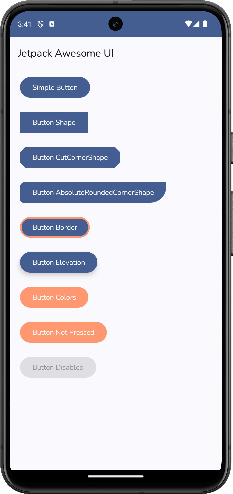
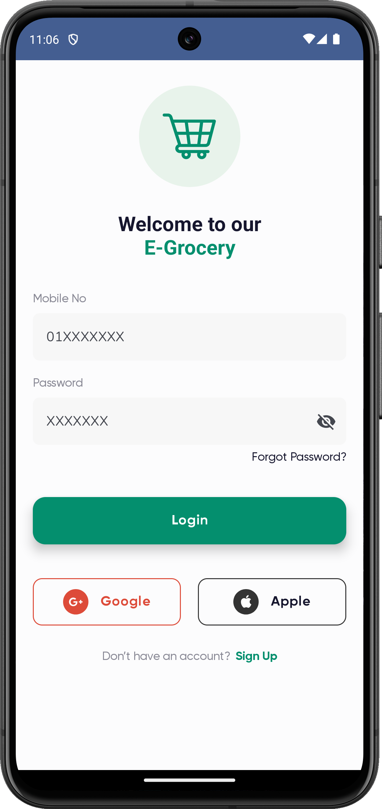

# Jetpack-Awesome-UI

**Jetpack Awesome UI** is a time-saving UI template designed specifically for Android developers,
built entirely with **Jetpack Compose**. This powerful toolkit empowers you to create stunning user
interfaces
in a fraction of the time, while maintaining a highly organized and structured codebase.

With its ready-to-use templates, **Material Design 3** compatibility, and emphasis on clean code,
**Jetpack Awesome UI** enables you to create visually stunning and highly functional apps with speed
and
ease.

## ✨Key Features:

- **Jetpack Compose**  
  Built entirely with Google’s modern, declarative UI toolkit.

- **Material Design 3**  
  Follows the latest Material Design 3 guidelines for a modern, consistent look and feel.

- **Ready-to-Use Templates**  
  Includes a comprehensive library of templates: screens, dialogs, buttons, forms, lists, and more.

- **Clean and Scalable Code**  
  Organized structure based on industry-standard practices for maintainable and scalable
  development.

## 🧩 Highlighted UI Component

- Animation
- App Bars
- Badges
- Bottom Navigation
- Bottom Sheet
- Box
- Buttons
- Card
- Carousel
- Checkbox
- Chips
- Column
- Date Picker
- Dialogs
- Divider
- Draggable
- Dropdown Menu
- Expansion Panel
- Floating Action Button
- Images & Icons
- Layout
- List (Column, Row & Grid)
- Menus
- Modifiers
- Motion
- Navigation Bar
- Navigation Drawer
- Navigation Rail
- Popups
- Progress Indicator
- Radio Button
- Row
- Scaffold
- Search Bar
- Shape & Images
- Side Sheets
- Sliders
- Snackbar
- Surface
- Swipe to Refresh
- Switches
- Tabs (Segmented button)
- Text & Typography
- Text Field
- Time Picker
- Tooltips

## 📱Highlighted UI Screens

- Splash
- Onboard
- Login
- Register
- Forgot Password
- OTP
- Lock Screen
- Dashboard
- Profile
- Maps
- Cart
- Favorites
- Notifications
- Settings
- Privacy
- About
- Empty State

## 📸 Screenshot

| 📋 Screens                                                     | 🧩 Components                                             | 🎞️ Apps                                                                  |
|----------------------------------------------------------------|-----------------------------------------------------------|---------------------------------------------------------------------------|
|         |  |  |
|         |    |  |

### 🏗️ Build & Run

- Open in **Android Studio**
- Run Sync Gradle
- Run the app on an emulator or physical device 🚀

## 🤝 Contribution Guidelines

1. **Fork**: Fork the repository to your GitHub account to avoid conflicts.
2. **Branch**: Create a new branch for your contribution.
3. **Changes**: Add or modify content while following the project's structure and code style.
4. **Commit**: Write clear, descriptive commit messages. Break large changes into multiple commits.
5. **Push**: Push changes to your forked repo.
6. **Pull Request**: Submit a PR with a clear description and include **screenshots** for UI
   changes.

Refer to [CONTRIBUTING.md](./CONTRIBUTING.md) for detailed contribution instructions.

## ⭐Star The Repo
If you find this project helpful, please ⭐️ **star the repo** and share it with your network.  
Let's help Android developers build beautiful UIs faster, together! 💪

